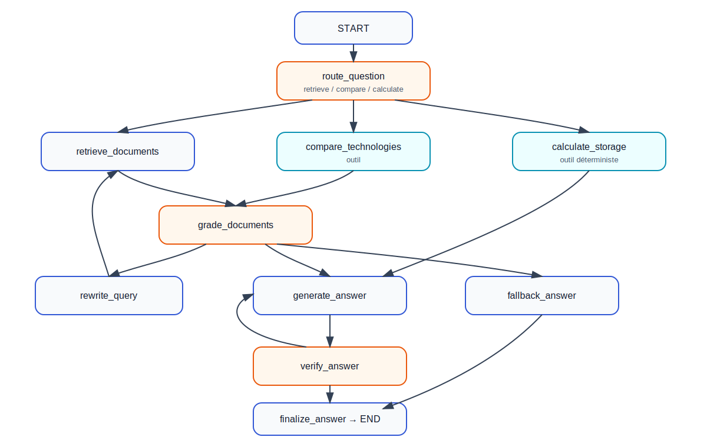

# Rapport final — Assistant Agentic RAG Big Data & Cloud

**Étudiant :** Marwane Qada  
**Dépôt GitHub :** https://github.com/marwaneqada/bigdata-agentic-rag  
**Projet :** assistant pédagogique Agentic RAG construit manuellement avec LangGraph, sans `create_agent`.

## 1. Objectif et corpus documentaire

L'objectif du projet est de construire un assistant capable de répondre à des questions de cours sur le Big Data et le Cloud à partir d'un corpus local. Le système combine recherche vectorielle, routage agentique, outils spécialisés, génération contrôlée et vérification de groundedness.

Le corpus indexé après nettoyage contient **6 documents de cours** et **18 chunks** :

- Apache Airflow ;
- Hadoop HDFS ;
- MinIO ;
- Kafka Streams ;
- Spark SQL ;
- Spark Structured Streaming.

Les fichiers de métadonnées et de documentation projet (`README`, `SOURCES.md`, `A_LIRE_AVANT_ENVOI.txt`) sont exclus de l'indexation afin d'éviter qu'ils apparaissent comme sources de réponse.

## 2. Prétraitement, découpage, embeddings et Chroma

Le module `src/document_loader.py` découvre les fichiers PDF, Markdown et texte, nettoie le contenu, puis le découpe en chunks par paragraphes avec une taille cible de 900 caractères et un chevauchement de 150 caractères. Les chunks trop courts sont ignorés.

Les embeddings sont produits avec `sentence-transformers/paraphrase-multilingual-MiniLM-L12-v2`, puis stockés dans une base Chroma persistante. L'index est reconstruit avec `python ingest.py --reset`. La dernière indexation validée a produit **18 chunks** à partir des **6 documents** de cours.

## 3. Architecture Agentic RAG avec LangGraph

L'architecture est définie dans `src/graph.py` avec un `StateGraph` manuel. Le graphe contient les nœuds suivants : `route_question`, `retrieve_documents`, `compare_technologies`, `calculate_storage`, `grade_documents`, `rewrite_query`, `generate_answer`, `verify_answer`, `fallback_answer` et `finalize_answer`.

Le flux général est le suivant : classification de la question, sélection de route, récupération ou outil spécialisé, filtrage de pertinence, génération, vérification, puis finalisation. Si les documents ne sont pas assez pertinents, la requête peut être reformulée avant une nouvelle récupération.

## 4. Outils et routage

Le système utilise trois routes :

- `retrieve` : questions standards de cours, définitions, explications et commandes ;
- `compare` : comparaisons explicites entre technologies ou concepts ;
- `calculate` : calculs numériques de stockage, réplication et compression.

Les outils principaux sont définis dans `src/tools.py` :

- recherche documentaire dans Chroma ;
- comparaison de technologies avec récupération de preuves pour chaque terme comparé ;
- calcul local déterministe de capacité.

Le calcul validé est :

**500 GB × 0.6 compression × facteur de réplication 3 × 2 copies = 1800 GB**.

## 5. Mémoire, reformulation et vérification

La mémoire conversationnelle est assurée par un checkpointer en mémoire et un `thread_id`. Cette mémoire est suffisante pour une démonstration locale, mais elle n'est pas persistante après redémarrage.

Le nœud `grade_documents` filtre les chunks individuellement afin de ne conserver que les extraits pertinents pour la génération et l'affichage des sources. Pour les comparaisons, la diversité des sources est préservée afin de garder des preuves pour les deux technologies.

La vérification de groundedness est effectuée avant la finalisation. Les informations de vérification restent dans les détails d'exécution et ne sont pas ajoutées comme commentaires visibles dans la réponse finale.

## 6. Expérimentation sur 20 questions

L'évaluation finale a été exécutée avec `python -m evaluation.run_evaluation` sur **20 questions** : **10 simples** et **10 complexes**. Les résultats ont été exportés vers `results/evaluation_results.csv` et `results/evaluation_summary.json`.

| Indicateur | Résultat validé |
|---|---:|
| Questions totales | 20 |
| Questions simples | 10 |
| Questions complexes | 10 |
| Temps moyen de réponse | 32.426 s |
| Qualité moyenne automatisée | 5.0/5 |
| Pertinence documentaire automatisée | 5.0/5 |
| Groundedness automatisée | 5.0/5 |
| Erreurs | 0 |
| Réponses vides | 0 |
| Fallbacks | 0 |
| Tests automatisés | 5 passés |

Les scores de qualité, pertinence et groundedness sont attribués par un évaluateur LLM automatisé. Ils ne sont donc pas équivalents à une évaluation humaine indépendante et peuvent être généreux.

## 7. Résultats et limites

Les routes validées couvrent les trois comportements attendus : recherche documentaire, comparaison et calcul. Les questions de comparaison utilisent la route `compare`, la question C06 utilise `calculate`, et les questions standards utilisent `retrieve`. Les sources affichées ne contiennent plus de fichiers de métadonnées.

Limites principales :

- corpus réduit à six documents ;
- latence moyenne d'environ 32 secondes ;
- plusieurs appels LLM par question ;
- état conversationnel en mémoire uniquement ;
- dépendance à Groq et à l'accès Internet ;
- évaluation automatisée potentiellement généreuse.

## 8. Conclusion

Le projet fournit un assistant Agentic RAG fonctionnel pour un corpus pédagogique Big Data et Cloud. L'architecture LangGraph reste explicite et maintenable, les outils locaux complètent la génération LLM, et l'évaluation finale confirme que les 20 questions ont été traitées sans erreur, sans fallback et sans réponse vide. Le système est prêt pour la présentation académique, sous réserve de mentionner clairement les limites liées au corpus, à la latence et à l'évaluation automatique.
